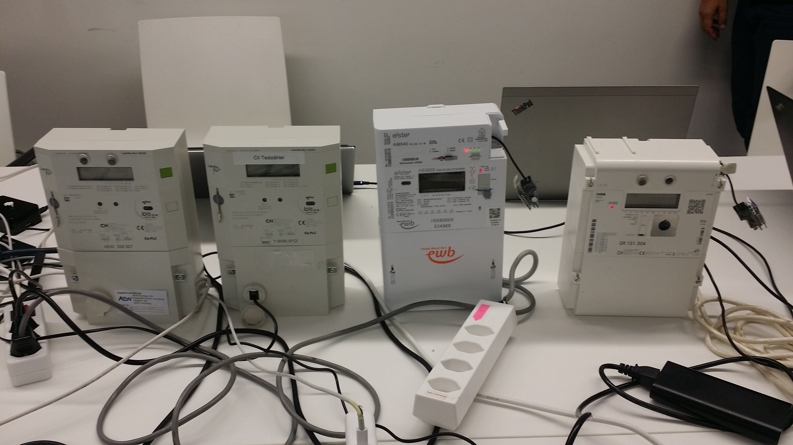

# Interoperability plug-test for smart meter’s local CII
Empower citizens to use their own energy data. Using the smartmeter's local interface for visualisation and automation

See [Challenge.md](Challenge.md)

See also repo smartmeter-datacollector here:
https://github.com/scs/smartmeter-datacollector

# Goal
Provide a unified and open API for all types of Smartmeters

# Idea
1. Read different types of smart meter CII (DLMS, IDIS CII, DSMR-P1, MBUS), used by different DSO (EKZ, AEW, EWB, Romande Energie) by means of a hardware metering data adapter and publish the data "as is" to an MQTT Broker
2. design a harmonized MQTT profile that can be used via an open visualization and automation.
3. implement an MQTT client that subscribes to the "raw" Smartmeter topics, translate the messages to the harmonized MQTT profile and publish them to the MQTT Broker.

The customer can thus use the data for further processing, visualisation or automation. As the MQTT topics are standardized, the customer does not need to care about the type of Smartmeter or DSO, it just works!

# Component Setup

| Smartmeters | Architecture |
| ------------- | ------------- |
|  |  |

# Results
* We connected to all four smart meters and converted their MQTT messages into a uniform structure
* We integrated the smart meter data into openHAB
* We persisted the data into influx and displayed it using grafana
* [Presentation](PitchChallenge_21_v2.pdf)

## Uniform MQTT profile
This is how the smart meters published their data:
```
EKZ: smartmeter/LGZ1030655933512/ACTIVE_POWER_P {"value": 1, "timestamp": 1629055611}
Romande Energie: tele/gPlug11/SENSOR {"Time":"2021-09-24T17:56:38","z":{"Pi":0}}
AEW: smartmeter/12345/ACTIVE_POWER_P {"value": 42.0, "timestamp": 1632499152}
EWB:  tele/gPlug10/SENSOR {"Time":"2021-09-24T17:03:45","z":{"Pi":12}}
```
And this is how our [transformer script](src) converted the data:
```
EKZ: smartmeter/<id od EKZ smart meter>/power/power_in {"timestamp": 1629055611, "value": 1}
Romande Energie: smartmeter/<id of Romande Energie smart meter>/power/power_in {"timestamp": 1632498998,"value": 0 }
AEW: smartmeter/<id od AEW smart meter>/power/power_in {"timestamp": 1632499152, "value": 42 }
EWB: smartmeter/<id od EWB smart meter>/power/power_in {"timestamp": 1632495825,"value": 12}
```

## Visualisation with Grafana


## Integration into openHAB


## Smartmeters and Adapters
### EKZ
* Brand: Landis+Gyr
* Model: [E450](https://www.landisgyr.ch/product/landisgyr-e450/)
* Interface: [MBUS](https://m-bus.com/)
* Adapter: [MBUS to USB adapter](https://www.empro.ch/en/products/interfaces/zeta-usb-interfaces/m-bus-slave/)
* Protocol: [DLMS/COSEM](https://www.dlms.com/dlms-cosem/)
* Configuration:
  * The MBUS to USB Adapter connects the Smartmeter to a [Raspberry Pi](https://www.raspberrypi.org/)
  * On the Raspberry Pi, the [smartmeter-datacollector](https://github.com/scs/smartmeter-datacollector) software retrieves data from the smart meter and publishes them to the mosquitto MQTT Broker that runs on the NUC.
  * smartmeter-datacollector depends on the [gurux library](https://github.com/Gurux/Gurux.DLMS.Python) for reading DLMS Data from the smart meter.

### AEW
* Brand: Landis+Gyr
* Model: [E450](https://www.landisgyr.ch/product/landisgyr-e450/)
* Interface: [MBUS](https://m-bus.com/)
* Adapter: [MBUS to TTL adapter](https://www.aliexpress.com/item/32751482255.html?spm=a2g0s.9042311.0.0.7e0c4c4dkWHVtG) and an USB to TTL/CMOS serial converter (e.g. FTDI FT232 or Prolific PL2303). Be sure that this converter does not contain a RS232 voltage converter (e.g. MAX232).
* Protocol: [DLMS/COSEM](https://www.dlms.com/dlms-cosem/)
* Configuration:
  * The MBUS-TTL-USB Adapter connects the Smartmeter to the NUC
  * On the NUC, the [smartmeter-datacollector](https://github.com/scs/smartmeter-datacollector) software was installed to retrieve data from the smart meter and publishe them to the mosquitto MQTT Broker. smartmeter-datacollector depends on the [gurux library](https://github.com/Gurux/Gurux.DLMS.Python) for reading DLMS Data from the smart meter.

### ewb
* Brand: Semax Honeywell Elster
* Model: [AS3000](https://semax.ch/as3000/) mit [AM540 Kommunikationsmodul](https://semax.ch/en/am540/)
* Interface: [DSMR P1](https://www.netbeheernederland.nl/_upload/Files/Slimme_meter_15_a727fce1f1.pdf)
* Adapter: DSMR P1 to WLAN [gPlug-Adapter](https://forume.ch/t/kundenschnittstelle-der-intelligenten-messsysteme/938/9)
* Protocol: [DSMR](https://www.netbeheernederland.nl/_upload/Files/Slimme_meter_15_a727fce1f1.pdf)
* Configuration:
  * the gPlug-Adapter reads the smart meter data and publishes it to an MQTT Broker (see below)

### Romande Energie
* Brand: ISKRA
* Model: [AM550](https://www.iskraemeco.hr/AM550.pdf)
* Interface: [DSMR P1](https://www.netbeheernederland.nl/_upload/Files/Slimme_meter_15_a727fce1f1.pdf)
* Adapter: DSMR P1 to WLAN [gPlug-Adapter](https://forume.ch/t/kundenschnittstelle-der-intelligenten-messsysteme/938/9)
* Protocol: [DSMR](https://www.netbeheernederland.nl/_upload/Files/Slimme_meter_15_a727fce1f1.pdf)
* Configuration:
  * the gPlug-Adapter reads the meter data and publishes it to an MQTT Broker (see below)

## [Raspberry Pi](https://www.raspberrypi.org/)
* install the [smartmeter-datacollector image](https://github.com/scs/smartmeter-datacollector/releases)
* Setup MQTT Bridge to transfer the messages to our main MQTT Broker on the NUC

## [gPlug-Adapter](https://forume.ch/t/kundenschnittstelle-der-intelligenten-messsysteme/938/9)
* The gPlug-Adapter is comprised of a voltage conversion circuit board and an ESP8266 flashed with [Tasmota firmware](https://tasmota.github.io/docs/P1-Smart-Meter/)
* some assembly required (not shown here)
* plug it into the smart meter P1 port
* connect to the WiFi access point that it makes (SSID: Tasmota....XXXX)
* in the configuration page (that pops up) configure access to your home WiFi
* 'save' and it reboots
* connect to the "new" IP on your home WiFi (http://<whatever>/) to access the Tasmota configuration page
* configure the MQTT host and topic and other Tasmota options
* 'save'
* More Information about DSMR P1 Adapter devices:
  * https://tasmota.github.io/docs/P1-Smart-Meter/ 
  * [ESP8266 thingies](http://www.esp8266thingies.nl/wp/)
  * [tweakers](https://tweakers.net/aanbod/2760894/p1-dsmr-slimme-meter-wifi-gateway-obv-esp8266.html)
  * [Domoticx](http://domoticx.com/p1-poort-slimme-meter-hardware/)

## [NUC](https://www.intel.com/content/www/us/en/products/details/nuc.html)
* install ubuntu
* install smartmeter-datacollector debian package
  * apply a [patch](https://github.com/tom-ch1/smartmeter-datacollector) to adapt smartmeter-datacollector to the AEW smart meter:
    * replace missing timestamp with the local time
    * replace missing device ID with a fake ID (12345)
* create a user for mqtt (password: hackday)
```
mosquitto_passwd -c /etc/mosquitto/pwfile hackday
```
* add a listener to /etc/mosquitto/:
```
allow_anonymous true
listener 1883
password_file /etc/mosquitto/pwfile
```
* no credentials are needed, but you can use hackday/hackday if you like

you can use the commandline client on the nuc: mosquitto_sub (subscribe) or mosquitto_pub (for publishing)
for instance:
```
mosquitto_sub -h localhost -t "#"
mosquitto_pub -h localhost -t "<your favorite topic>" -m "<your message>" (edited) 
```

# Team

Peter Kreutzer, Derrick Oswald, Jonas Matt, Herrmann Hueni, Jordi Campos, Angelos Selviaridis, Thomas Strösslin
